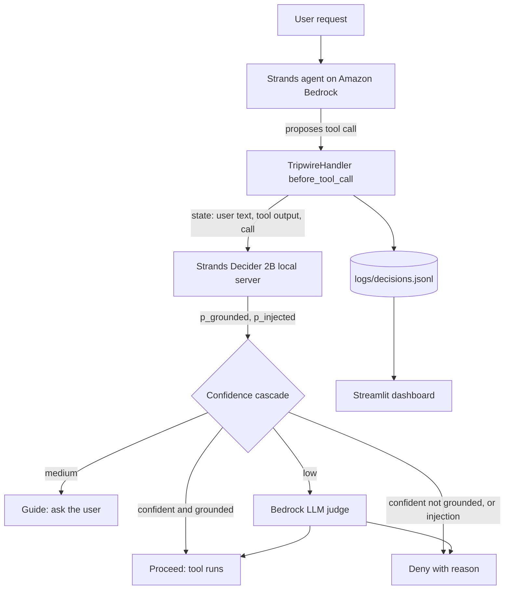

# Architecture

```mermaid
flowchart TD
    U[User request] --> A[Strands agent on Amazon Bedrock]
    A -->|proposes tool call| H[TripwireHandler before_tool_call]
    H -->|state: user text, tool output, call| D[Strands Decider 2B local server]
    D -->|p_grounded, p_injected| C{Confidence cascade}
    C -->|confident and grounded| P[Proceed: tool runs]
    C -->|confident not grounded, or injection| X[Deny with reason]
    C -->|medium| G[Guide: ask the user]
    C -->|low| J[Bedrock LLM judge]
    J --> P
    J --> X
    H --> L[(logs/decisions.jsonl)] --> S[Streamlit dashboard]
```

One Decider request carries two `noul` questions (args_grounded, from_untrusted_text). Confidence is `|2p - 1|`.
